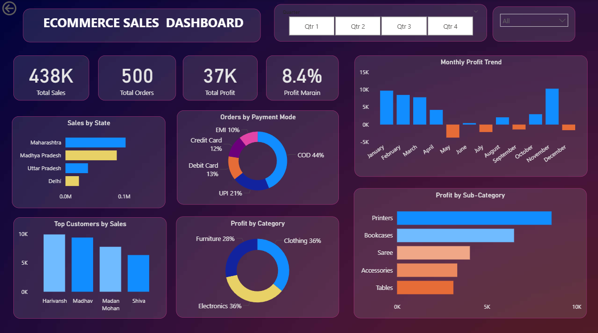

# E-Commerce Customer & Sales Analytics

An end-to-end data analytics project analyzing e-commerce transaction data to uncover sales performance, profitability, customer behavior, product performance, regional trends, and business opportunities.

## Project Overview

The project started with raw e-commerce transaction data stored across two CSV files:

- Orders.csv — order date, customer, state and city information
- Details.csv — sales amount, profit, quantity, category, sub-category and payment mode

The data was analyzed using Python, SQL and Power BI to move from data quality checks and exploratory analysis to business insights and recommendations.

## Business Objective

The objective is to understand:

- What drives sales and profit?
- Which categories and sub-categories perform best?
- Which products generate high sales but weak profitability?
- Which customers contribute the most revenue and profit?
- Which regions perform well or poorly?
- How does profitability change over time?
- Which payment methods are most commonly used?
- Where are the biggest business opportunities and problems?

## Tech Stack

- Python
- Pandas
- NumPy
- Matplotlib
- Seaborn
- MySQL
- SQL
- Power BI
- DAX
- Power Query
- Excel
- Git & GitHub

## Project Workflow

Raw CSV Data
→ Data Quality Checks
→ Data Cleaning
→ Data Merging
→ Feature Engineering
→ Python EDA
→ SQL Business Analysis
→ Power BI Dashboard
→ Business Insights
→ Recommendations

## Dataset

### Orders.csv

Contains order-level information:

- Order ID
- Order Date
- CustomerName
- State
- City

### Details.csv

Contains transaction-level information:

- Order ID
- Amount
- Profit
- Quantity
- Category
- Sub-Category
- PaymentMode

The two datasets were connected using `Order ID`.

## Data Quality & Cleaning

The following checks were performed:

- Missing value analysis
- Duplicate row detection
- Data type validation
- Orders–Details relationship validation
- Date format validation
- Text consistency checks
- Numeric validity checks
- Outlier/anomaly investigation

### Cleaning Decisions

- Converted `Order Date` from text format into a proper datetime format.
- Removed unnecessary whitespace from State values.
- Verified that Amount and Quantity contained no invalid zero/negative values.
- Reviewed extreme sales and profit values.
- Valid-looking extreme transactions were retained instead of being removed automatically because they may represent genuine business activity.

## Python Analysis

Python and Pandas were used for:

- Data loading
- Data cleaning
- Dataset merging
- Feature engineering
- Exploratory Data Analysis
- Customer analysis
- Product and category analysis
- Regional analysis
- Time-based analysis
- Profitability analysis

Additional features created:

- Year
- Month
- Month Name
- Profit Margin %
- Loss Making Flag

## Statistical Analysis

Basic statistical techniques were used where relevant:

- Mean
- Median
- Standard deviation
- Distribution analysis
- Correlation analysis
- Outlier investigation

Correlation analysis showed that:

- Amount and Profit have a weak-to-moderate positive relationship.
- Amount and Quantity have a weak-to-moderate positive relationship.
- Quantity and Profit have almost no linear relationship.

This indicates that selling more units does not necessarily result in higher profit.

## Key Business Metrics

Based on the available dataset:

- Total Sales: ₹437,771
- Total Profit: ₹36,963
- Profit Margin: 8.44%
- Total Quantity Sold: 5,615
- Total Orders: 500
- Unique Customers: 336
- Loss-Making Transaction Lines: 529

## Key Findings

### Category Performance

Electronics generated the highest sales, while Clothing generated slightly higher profit despite lower sales.

This demonstrates that higher revenue does not necessarily mean higher profitability.

### Sub-Category Performance

Strong profit-generating sub-categories included:

- Printers
- Bookcases
- Accessories
- Shirts
- T-shirts

Loss-making sub-categories included:

- Electronic Games
- Furnishings
- Kurti
- Skirt
- Leggings

Electronic Games generated ₹39,168 in sales but recorded a loss of ₹644.

### Monthly Performance

Profitability varied significantly throughout the year.

Strong profit months included:

- January
- February
- March
- November

Loss-making months included:

- May
- July
- September
- December

November generated the highest monthly profit of ₹10,253.

### Customer Analysis

Customer analysis showed that high-sales customers are not always the most profitable.

For example, some customers generated significant sales while still producing negative profit.

This highlights the importance of evaluating customer value using both revenue and profitability.

### Regional Performance

Maharashtra generated the highest sales at ₹102,498.

Madhya Pradesh generated the highest profit at ₹7,382.

Some regions generated sales but recorded negative overall profit, including:

- Rajasthan
- Andhra Pradesh

This indicates that regional performance should be evaluated using profitability rather than sales alone.

### Payment Method Analysis

COD generated the highest sales volume.

Credit Card transactions generated a higher profit margin than other payment methods in this dataset.

However, payment method should be treated as an observed association rather than a direct cause of profitability.

## SQL Analysis

MySQL was used to create a relational analysis layer using the Orders and Details tables.

SQL analysis progressed from basic queries to advanced analytical techniques.

### SQL Concepts Used

- SELECT
- WHERE
- GROUP BY
- HAVING
- CASE WHEN
- JOIN
- Subqueries
- CTEs
- RANK()
- DENSE_RANK()
- LAG()
- Window Functions
- Running Totals
- Month-over-Month Analysis
- Customer Rankings
- Product/Sub-Category Rankings

SQL files are organized as:

- `01_basic_analysis.sql`
- `02_business_analysis.sql`
- `03_advanced_analysis.sql`

## Power BI Dashboard

The Power BI dashboard was upgraded from the original E-Commerce Sales Dashboard into an analytics-focused business dashboard.

### Dashboard Features

- Total Sales
- Total Profit
- Profit Margin
- Total Orders
- Customer analysis
- State-wise sales
- Monthly profit trend
- Category profitability
- Sub-category profitability
- Payment mode analysis
- Interactive filters

### DAX Measures

Key DAX measures created include:

- Total Sales
- Total Profit
- Profit Margin
- Total Orders
- Total Customers
- Loss Making Transactions



## Business Recommendations

Based on the analysis:

1. Investigate loss-making sub-categories such as Electronic Games and Furnishings to understand pricing, discounting or product-level profitability issues.

2. Monitor high-sales but low-margin products such as Phones where revenue contribution is strong but profitability is relatively weak.

3. Investigate consistently loss-making months to understand whether product mix, pricing or regional performance contributed to the losses.

4. Evaluate regional performance using both revenue and profit instead of sales volume alone.

5. Track customer profitability alongside customer revenue to identify high-value and potentially loss-making customer segments.

6. Focus on consistently profitable sub-categories while investigating the causes behind loss-making products.

## Project Structure

```text
E-Commerce-Customer-Sales-Analytics/
│
├── data/
│   ├── Orders.csv
│   └── Details.csv
│
├── python/
│   └── E-Commerce_Customer_Sales_Analysis.ipynb
│
├── sql/
│   ├── 01_basic_analysis.sql
│   ├── 02_business_analysis.sql
│   └── 03_advanced_analysis.sql
│
├── power-bi/
│   └── E-Commerce Customer Sales Analytics.pbix
│
├── dashboard.png
│
└── README.md
